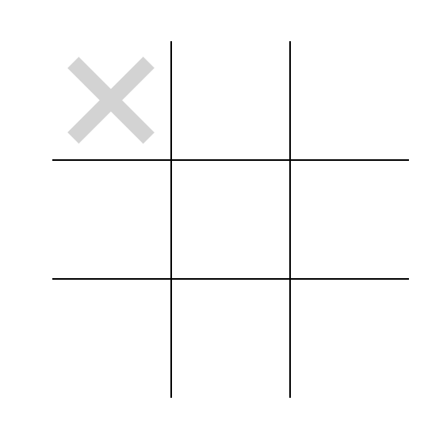

# Tic Tac Toe

This is a simple Tic Tac Toe game built using HTML, CSS, and JavaScript.

## To play:

1. Click on a cell to mark it with your symbol.
2. The first player to get three of their symbols in a row wins.
3. If the board is filled up and no one has won, the game is a tie.

## Controls:

* Click on a cell to mark it with your symbol.
* Click on the "Restart" button to start a new game.

## Requirements:

* A web browser that supports HTML, CSS, and JavaScript.

## License:

This project is licensed under the MIT License.
